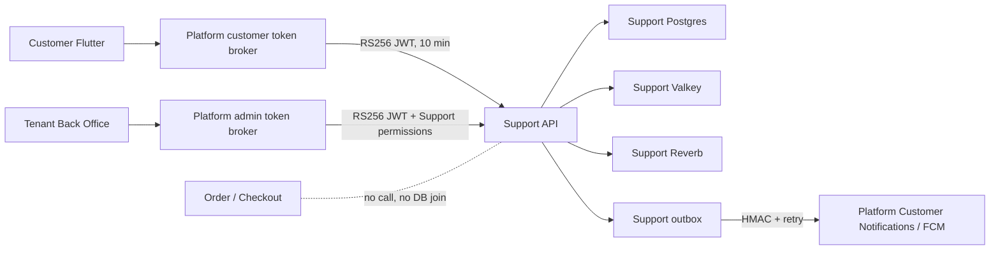

# Isolated Customer Support Service

## Scope

Customer Support is a separate operational domain. It must be possible to stop
Support Postgres, Valkey, worker, or Reverb without changing the availability or
latency path of Lottery search, Cart, Checkout, payment, or Order.

Runtime Support database: `newpaotang_support`.

Automated Support database: `newpaotang_support_test`.

The Support service must not receive Platform database credentials. Platform
and Support share only an asymmetric authentication trust and one HMAC secret
for outbox delivery.

## Customer UI

Routes:

- `/support`: Help Center, active ticket, FAQ search/accordion, history entry.
- `/support/new`: three-step ticket draft and image upload.
- `/support/tickets`: active/closed cursor history.
- `/support/tickets/:ticketId`: queue state, chat, closed detail, rating.

Entry points:

- Home headset icon before the notification bell, with Support unread badge.
- Profile menu label “ศูนย์ช่วยเหลือ”.
- Customer Notification/FCM action `support_ticket`, gated through Login/PIN.

Support routes use the existing runtime theme/localization and title-only blue
header with a white rounded content sheet. They do not render BottomNav. Back
navigation pops real history when possible and otherwise returns to `/support`.

The customer flow covers:

- tenant disabled, loading, empty, no result, API error, and retry states;
- active-ticket resume and one-open-ticket redirect;
- category selection including tenant fallback `other`;
- contextual FAQ and helpful/not-helpful feedback;
- subject 120 characters, body 4,000 characters;
- runtime-configured JPEG/PNG/WebP limits (default four images and 8 MB each)
  with progress/remove/retry;
- stable idempotency key for create/send/close/rating retries;
- queue position without ETA and assigned-agent state;
- FAQ reading and first-ticket submission remain available even when no agent
  is Available. The initial issue is stored with the queued ticket, while the
  chat composer stays locked until an agent accepts the work. The Support API
  enforces this boundary with `chat_available` and rejects queued customer
  messages with `ticket_waiting_for_agent`;
- an automatic localized welcome system message after ticket creation, including
  the live queue position and tenant override support through
  `content_json.messages.ticket_created`;
- old-message pagination while preserving scroll;
- customer/admin/system messages, date separators, timestamps, and read state;
- new-message button while reading older content;
- fixed safe-area composer and closed-ticket draft preservation;
- close bottom sheet, deferred 1-5 star rating, and reference-new-ticket action.

## Authentication And Realtime

Flutter and BO call their Platform broker with the current authenticated
session. The broker returns:

- Support JWT and expiry;
- runtime Support API URL;
- runtime Support Reverb URL/key/auth path;
- channel prefix and base channels allowed to that actor.

Support channel authorization rechecks tenant, actor, ticket ownership or
assignment, and master queue permission. Events contain only ticket ID and
status. Clients refetch records from REST. If realtime disconnects, active chat
uses bounded polling until reconnect.

Browser access is runtime allowlisted with `SUPPORT_CORS_ALLOWED_ORIGINS` and
Support Reverb uses the separate `SUPPORT_REVERB_ALLOWED_ORIGINS` allowlist.
Reverb entries are hostname patterns after normalization, so tenant domains
must include their root hostname and an explicit wildcard such as
`example.com,*.example.com`; the global `*` value is not used by default.
Support bearer requests do not enable credentialed cross-origin cookies.

## Queue And Roles

`support`:

- turns Available on/off and sends heartbeat;
- receives FIFO work up to capacity;
- sees, replies to, waits, and closes assigned tickets only.
- lands directly on `/admin/tenant/support` when the account has no Dashboard
  permission;
- sees only My Tickets and Reports inside the Support workspace;
- Reports are always forced to that support actor, even if a different
  `actor_id` is supplied manually.

`master_support`:

- sees My Tickets, Queue, All, and Closed;
- replies, assigns/reassigns, and closes;
- manages per-agent capacity, categories, FAQs, and tenant settings;
- sees the team report overview and can select an individual support actor.

Tenant owners with the same Support report and view-all permissions also receive
the team overview and individual-agent selector. Report scoping is enforced by
Support API permissions rather than by hiding controls in the Back Office alone.

Assignment selects an Available agent with a fresh heartbeat and remaining
capacity, then orders by current open workload and `last_assigned_at`. Assigned
work is not moved merely because an agent goes offline.

## Notification Boundary

Support creates an idempotent outbox row for:

- new agent message;
- ticket assigned;
- waiting for customer;
- ticket closed/rating requested.

The worker sends the localized event to
`/api/v1/internal/customer-support/notifications` with
`X-Support-Signature` and stable `X-Support-Event-Id`. Platform owns recipient
validation, inbox unread state, FCM delivery, and deep links. Failure uses retry
and circuit-breaker behavior without blocking the Support write.

## Rollout Gate

1. Provision isolated Support infrastructure and secrets.
2. Migrate only `newpaotang_support`.
3. Verify Support health, private attachments, worker, scheduler, and Reverb.
4. Verify Platform brokers, HMAC ingress, and RBAC.
5. Deploy BO and Flutter with Support feature still disabled.
6. Enable `customer_support` for an internal tenant.
7. Validate Web/Simulator chat, native push, deep link through PIN, and rating.
8. Stop each Support dependency and load Order/Checkout concurrently; Support
   may degrade, but Commerce success rate and latency must stay within the
   existing operational threshold.
9. Expand tenant by tenant.

No runtime Support migration or feature enablement is implied by this document.

Production manifests live in `deploy/digitalocean-support/support-api.yaml` with the
isolated API, worker, scheduler, Reverb, services, ingress, PDB, and API HPA.
The production workflow always builds the Support image, but it applies Support
workloads only after a manual `deploy_support=true` rollout. The isolated
Support migration has an additional manual `run_support_migration=true` gate.
Normal branch pushes do not deploy or migrate Support.

## Verification Status

Verified on 2026-07-23 without runtime migrations:

- Support API: 26 tests, 171 assertions on `newpaotang_support_test`, including
  CORS, exact role permissions, assignment eligibility, private attachments,
  idempotency, welcome/queue messages, unread state, rating, realtime
  authorization, and outbox circuit breaking. Runtime Reverb origin URLs are
  normalized to the host values expected by Laravel Reverb and remain
  fail-closed when unconfigured.
- Platform broker/RBAC/HMAC ingress: 11 tests, 153 assertions on
  `newpaotang_test`.
- Customer Flutter: full analysis plus 61 focused model, repository, screen,
  route, notification, Home, and Profile tests.
- Commerce isolation: all 7 Checkout tests and 140 assertions pass while no
  Support compose service is running. Commerce modules have no Support client
  or Support database dependency.
- Builds: Flutter Web release, Android debug APK, iOS Simulator debug, Back
  Office production, and the Support API Docker image. Android release correctly
  remains blocked until deployment injects the private
  `android/app/google-services.json`.
- Deployment validation: Compose config, production Kustomize render, workflow
  YAML, Support manifests, and Support OpenAPI all parse successfully.

Physical-device push delivery and production failure/load acceptance remain
rollout checks. The verification checkpoint above did not touch runtime
databases; the later owner-authorized local activation is recorded below.

## Local Runtime Activation

Activated on 2026-07-23 by explicit owner instruction:

- Applied the Support schema to isolated runtime DB `newpaotang_support`
  (migration batch 1).
- Applied only the two Platform Support broker/RBAC migrations to runtime DB
  `newpaotang` (migration batch 6); no unrelated pending migration was run.
- Enabled `customer_support` for tenant `pchoke1`.
- Provisioned the runtime Support tenant, fallback category, settings, the
  existing customer snapshot, and the existing owner-admin snapshot.
- Started `support-api`, `support-worker`, `support-scheduler`,
  `support-reverb`, `support-postgres`, and `support-valkey`.
- Rebuilt Customer Flutter Web and recreated Platform API, Back Office, and the
  local proxy with Support runtime configuration.
- Verified API readiness through the proxy, Customer/Admin bootstrap,
  CORS preflight, Valkey, scheduler/worker execution, and a successful Reverb
  WebSocket handshake.

Local entry points:

- Customer: `http://xn--42cl1cp5p.localhost/support`
- Back Office: `http://bo.xn--42cl1cp5p.localhost/admin/tenant/support`

No fresh, wipe, reset, or destructive migration command was used.
